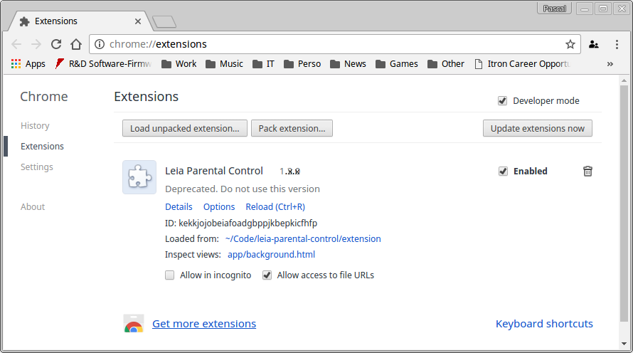

# Leia Parental Control

Leia parental control is a tool to monitor children time on the internet.

This GIT repository contains the source of the Google Chrome Extension and the source of the Web Application.

Feel free to download and update either or both.

## Prerequisites

Prior to building LeiaParentalControl you should have installed:

* the Chrome browser       
  > [chrome website](https://www.google.com/chrome/)

* nodejs
  > [nodejs website](https://nodejs.org/en/)
  Version 6.9.1 was used when writing this.

## Optionnal tools

This is what I use, this is optionnal, if you're more confortable with something else it is alright with me. 

* visual studio code

  > [visualstudio code website](https://code.visualstudio.com/)

## Building Extension
The extension is written in HTML, CSS and typescript.
To compile Typescript run the tsc compiler from the extension folder: 

        cd extension
        npm install
        npm run tsc

This is it. By default the tsc compiler will continue compiling in watch mode. 

## Installing Extension
In chrome navigate to [chrome://extensions/]
Click the button Load unpacked extension...
Select the "extension" folder in the root of this repository.

## Building Site
The site is written in HTML, CSS and typescript.
To compile Typescript run the tsc compiler from the site folder: 

        cd site
        npm install
        npm run serve

This is it. By default the tsc compiler will continue compiling in watch mode. 

## Running Site
To run a local webserver 

        cd site
        chmod +x serve
        ./serve

## Your job
Please tell me if I missed something in these instructions. 

